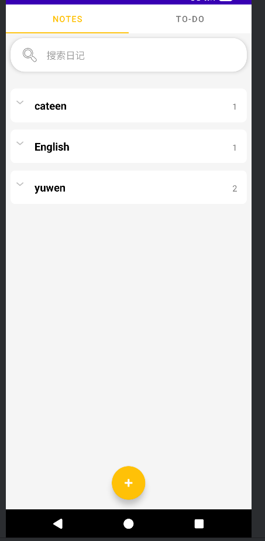
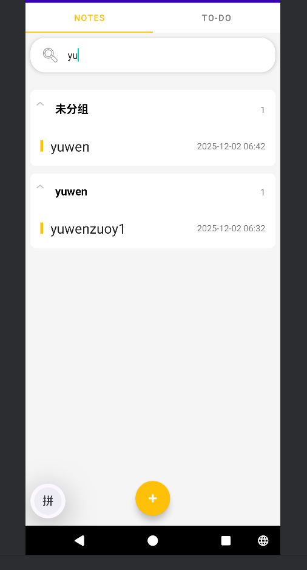
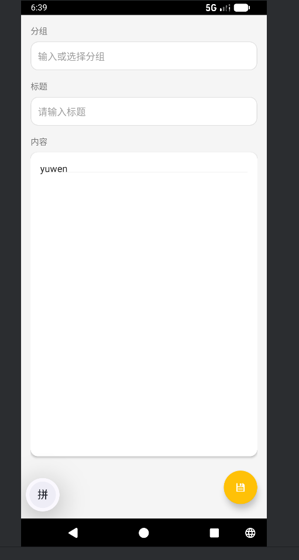
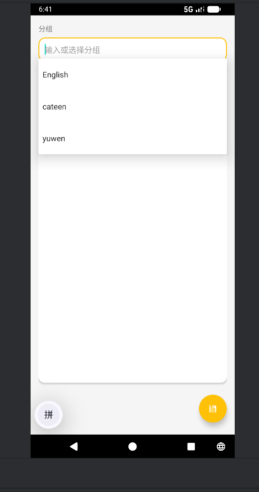
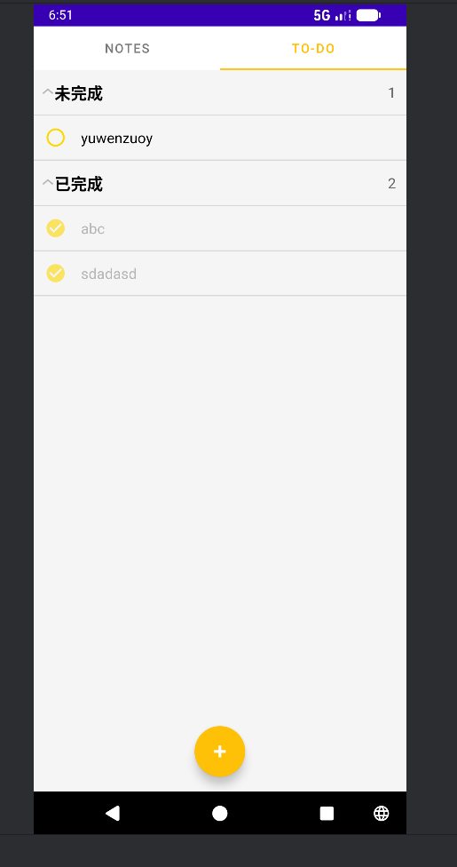
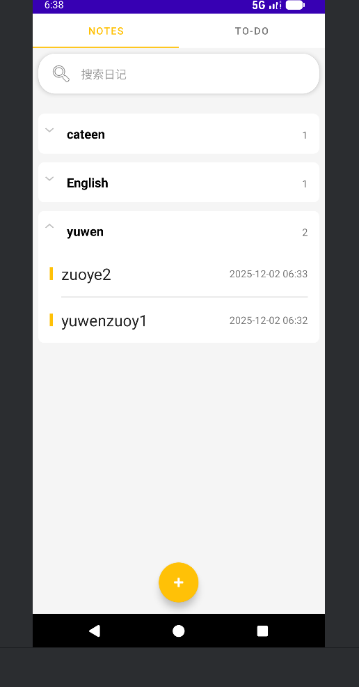

# NotePad 增强版笔记应用


增强版的Android记事本应用程序，在官方NotePad示例基础上进行了大量功能扩展和界面优化。

## 📋 目录
- [NotePad 增强版笔记应用](#notepad-增强版笔记应用)
  - [📋 目录](#-目录)
  - [项目简介](#项目简介)
  - [核心功能](#核心功能)
    - [基础功能](#基础功能)
      - [1. 时间戳功能](#1-时间戳功能)
        - [功能介绍](#功能介绍)
        - [实现思路](#实现思路)
        - [核心代码](#核心代码)
        - [界面展示](#界面展示)
      - [2. 搜索功能](#2-搜索功能)
        - [功能介绍](#功能介绍-1)
        - [实现思路](#实现思路-1)
        - [核心代码](#核心代码-1)
        - [界面展示](#界面展示-1)
    - [扩展功能](#扩展功能)
      - [1. 界面美化](#1-界面美化)
        - [功能介绍](#功能介绍-2)
        - [实现思路](#实现思路-2)
        - [核心代码](#核心代码-2)
        - [界面展示](#界面展示-2)
      - [2. 待办事项功能](#2-待办事项功能)
        - [功能介绍](#功能介绍-3)
        - [实现思路](#实现思路-3)
        - [核心代码](#核心代码-3)
        - [界面展示](#界面展示-3)
      - [3. 分组功能](#3-分组功能)
        - [功能介绍](#功能介绍-4)
        - [实现思路](#实现思路-4)
        - [核心代码](#核心代码-4)
        - [界面展示](#界面展示-4)
  - [安装与使用](#安装与使用)
    - [系统要求](#系统要求)
    - [构建步骤](#构建步骤)
    - [使用说明](#使用说明)
  - [项目结构](#项目结构)

## 项目简介

NotePad增强版是一款基于Android原生API开发的笔记管理应用程序。它继承了官方NotePad示例的核心功能，并在此基础上增加了时间戳记录、搜索功能、界面美化、待办事项管理和笔记分组等实用功能。该项目不仅展示了Android开发的基础知识，还体现了现代Android应用的设计理念和最佳实践。

## 核心功能

### 基础功能

#### 1. 时间戳功能

##### 功能介绍
- 自动记录每条笔记的创建时间和最后修改时间
- 在笔记列表中清晰显示修改时间，方便用户快速识别最近编辑的笔记
- 时间格式统一为：`yyyy-MM-dd HH:mm`

##### 实现思路
时间戳功能通过在数据库中存储创建和修改时间来实现。每当创建或修改笔记时，都会自动更新时间戳。在显示时，我们使用SimpleDateFormat将时间戳格式化为易读的格式。

在[NoteEditor](app/src/main/java/com/example/android/notepad/NoteEditor.java)中，每次保存笔记时都会调用[updateNote](app/src/main/java/com/example/android/notepad/NoteEditor.java)方法，该方法会自动将当前系统时间设置为修改时间。在[NotesFragment](app/src/main/java/com/example/android/notepad/NotesFragment.java)中，使用[SimpleDateFormat](https://developer.android.com/reference/java/text/SimpleDateFormat)将时间戳格式化为用户友好的格式显示。

##### 核心代码
````java
// 在NoteEditor.java中的updateNote方法中自动更新修改时间
private final void updateNote(String title, String text, String category) {
    // Sets up a map to contain values to be updated in the provider.
    ContentValues values = new ContentValues();
    // Always update the modification date when saving
    values.put(NotePad.Notes.COLUMN_NAME_MODIFICATION_DATE, System.currentTimeMillis());
    
    // 其他更新逻辑...
}

// 在NotesFragment.java中格式化显示时间
Note note = (Note) getChild(groupPosition, childPosition);
title.setText(note.title);
date.setText(new SimpleDateFormat("yyyy-MM-dd HH:mm").format(new Date(note.modificationDate)));
````

##### 界面展示


#### 2. 搜索功能

##### 功能介绍
- 支持对笔记标题和内容进行实时搜索
- 搜索结果即时显示，提供流畅的用户体验
- 搜索过程中保持笔记分组结构，便于定位特定笔记
- 支持在搜索结果中进一步按分类筛选
- 搜索功能排除待办事项，专注于普通笔记内容

##### 实现思路
搜索功能实现在[NotesFragment](app/src/main/java/com/example/android/notepad/NotesFragment.java)中，通过对输入文本的监听实时过滤笔记列表。我们使用TextWatcher监听搜索框的变化，并在适配器中实现过滤逻辑。当检测到搜索关键字时，系统会构造SQL查询语句同时在笔记标题([COLUMN_NAME_TITLE](app/src/main/java/com/example/android/notepad/NotePad.java))和内容([COLUMN_NAME_NOTE](app/src/main/java/com/example/android/notepad/NotePad.java))字段中进行模糊匹配搜索。

在[NotesExpandableListAdapter](app/src/main/java/com/example/android/notepad/NotesFragment.java)中实现了[filter](app/src/main/java/com/example/android/notepad/NotesFragment.java)方法来处理搜索逻辑。当有搜索关键词时，会构建包含LIKE条件的SQL查询语句，并排除待办事项（通过过滤category为todo_pending和todo_completed的记录）。

##### 核心代码
````java
// 在NotesFragment.onCreateView中设置文本监听器
mSearchEditText.addTextChangedListener(new TextWatcher() {
    @Override
    public void beforeTextChanged(CharSequence s, int start, int count, int after) {
    }

    @Override
    public void onTextChanged(CharSequence s, int start, int before, int count) {
        mAdapter.filter(s.toString());
    }

    @Override
    public void afterTextChanged(Editable s) {
    }
});

// 在NotesExpandableListAdapter中的filter方法实现搜索逻辑
public void filter(String query) {
    mQuery = query;
    refresh();
}

// 在refresh方法中处理搜索逻辑
if (mQuery != null && mQuery.length() > 0) {
    // Build selection criteria for all notes with search filter, excluding todo items
    String todoFilter = " AND " + NotePad.Notes.COLUMN_NAME_CATEGORY + " NOT IN ('todo_pending', 'todo_completed')";
    String selection = "(" + NotePad.Notes.COLUMN_NAME_TITLE + " LIKE ? OR " + NotePad.Notes.COLUMN_NAME_NOTE + " LIKE ?)" + todoFilter;
    String[] selectionArgs = new String[]{"%" + mQuery + "%", "%" + mQuery + "%"};
    
    Cursor noteCursor = mContext.getContentResolver().query(
            NotePad.Notes.CONTENT_URI,
            SEARCH_NOTE_PROJECTION,
            selection,
            selectionArgs,
            NotePad.Notes.COLUMN_NAME_MODIFICATION_DATE + " DESC");
}
````

##### 界面展示


### 扩展功能

#### 1. 界面美化

##### 功能介绍
- 采用Material Design设计风格，提升视觉体验
- 使用浮动操作按钮(FAB)替代传统菜单项，提高操作效率
- 优化笔记列表展示效果，采用卡片式设计和圆角边框
- 引入主题色彩搭配，使界面更加美观现代

##### 实现思路
界面美化主要体现在使用Material Design组件和自定义样式。我们替换了传统的ActionBar菜单项，改用FloatingActionButton作为主要操作按钮，并优化了列表项的视觉效果。

通过在[NoteEditor](app/src/main/java/com/example/android/notepad/NoteEditor.java)中使用[FloatingActionButton](https://developer.android.com/reference/com/google/android/material/floatingactionbutton/FloatingActionButton)替代传统的菜单项，提高了用户的操作效率。同时，通过自定义drawable资源文件实现了圆角边框和分组背景效果。

在布局文件[note_editor.xml](app/src/main/res/layout/note_editor.xml)中使用CoordinatorLayout作为根布局，配合FloatingActionButton实现悬浮按钮效果。通过自定义drawable资源如[rounded_corners.xml](app/src/main/res/drawable/rounded_corners.xml)实现圆角卡片效果。

##### 核心代码
```java
// 在NoteEditor.java中使用FloatingActionButton替代传统菜单
mFabSaveNote = findViewById(R.id.fab_save_note);
mFabSaveNote.setOnClickListener(new View.OnClickListener() {
    @Override
    public void onClick(View v) {
        updateNote();
        setResult(RESULT_OK);
        finish();
    }
});
```

##### 界面展示


#### 2. 待办事项功能

##### 功能介绍
- 集成独立的待办事项管理模块
- 支持标记待办事项为已完成状态
- 待办事项按状态分组显示（未完成/已完成）
- 提供直观的状态图标和视觉区分

##### 实现思路
待办事项功能通过特殊的分类标识(todo_pending/todo_completed)实现状态管理。我们在[TodoFragment](app/src/main/java/com/example/android/notepad/TodoFragment.java)中实现了ExpandableListView来展示分组，并通过切换分类标识来改变待办事项状态。

具体实现上，待办事项使用特殊的category值来标识其状态：
- [todo_pending](app/src/main/java/com/example/android/notepad/TodoFragment.java)表示未完成的待办事项
- [todo_completed](app/src/main/java/com/example/android/notepad/TodoFragment.java)表示已完成的待办事项

通过点击待办事项可以切换其状态，这在[toggleTodoStatus](app/src/main/java/com/example/android/notepad/TodoFragment.java)方法中实现。同时使用不同的图标和视觉效果来区分不同状态的待办事项。

##### 核心代码
```java
// 在TodoFragment.java中切换待办事项状态
private void toggleTodoStatus(long todoId) {
    // 获取待办事项当前状态
    Cursor cursor = getActivity().getContentResolver().query(
            Uri.withAppendedPath(NotePad.Notes.CONTENT_ID_URI_BASE, String.valueOf(todoId)),
            new String[]{NotePad.Notes.COLUMN_NAME_CATEGORY},
            null,
            null,
            null
    );
    
    if (cursor != null && cursor.moveToFirst()) {
        int categoryIndex = cursor.getColumnIndex(NotePad.Notes.COLUMN_NAME_CATEGORY);
        String currentCategory = cursor.getString(categoryIndex);
        cursor.close();
        
        // 切换状态
        String newCategory;
        if (TODO_STATUS_PENDING.equals(currentCategory)) {
            newCategory = TODO_STATUS_COMPLETED; // 标记为已完成
        } else {
            newCategory = TODO_STATUS_PENDING; // 标记为未完成
        }
        
        // 更新数据库
        ContentValues values = new ContentValues();
        values.put(NotePad.Notes.COLUMN_NAME_CATEGORY, newCategory);
        values.put(NotePad.Notes.COLUMN_NAME_MODIFICATION_DATE, System.currentTimeMillis());
        
        getActivity().getContentResolver().update(
                Uri.withAppendedPath(NotePad.Notes.CONTENT_ID_URI_BASE, String.valueOf(todoId)),
                values,
                null,
                null
        );
        
        // 刷新列表
        refreshTodos();
    }
}
```

##### 界面展示


#### 3. 分组功能

##### 功能介绍
- 支持为笔记添加自定义分组标签
- 自动将相同分组的笔记归类显示
- 提供分组筛选功能，可按特定分组查看笔记
- 对未分组的笔记单独归类，保持界面整洁

##### 实现思路
分组功能允许用户为笔记分配分类标签，并在主界面中按分组显示。我们使用ExpandableListView实现分组展示，并在编辑界面提供自动补全功能来帮助用户快速选择已有分组。

在[NoteEditor](app/src/main/java/com/example/android/notepad/NoteEditor.java)中使用[AutoCompleteTextView](https://developer.android.com/reference/android/widget/AutoCompleteTextView)实现分组名称的自动补全功能，用户输入时会显示匹配的历史分组名称。在[NotesFragment](app/src/main/java/com/example/android/notepad/NotesFragment.java)中通过查询数据库获取所有分组信息，并使用ExpandableListView展示分组及各组下的笔记。

对于没有指定分组的笔记，统一归类到"未分组"类别下显示，保证界面的一致性和整洁性。

##### 核心代码
````java
// 在NoteEditor.java中实现分组自动补全
private void initCategoryAutoComplete() {
    mCategoryList = getCategoryList();
    mCategoryAdapter = new ArrayAdapter<>(this, android.R.layout.simple_dropdown_item_1line, mCategoryList);
    mCategoryAutoComplete.setAdapter(mCategoryAdapter);
    mCategoryAutoComplete.setThreshold(1); // 输入1个字符后开始匹配
    
    // 监听文本变化，同步更新底部显示
    mCategoryAutoComplete.setOnItemClickListener((parent, view, position, id) -> {
        mCurrentCategory = mCategoryList.get(position);
        mCategoryAutoComplete.setText(mCurrentCategory);
    });
    
    // 监听输入框点击事件，确保点击时显示所有选项
    mCategoryAutoComplete.setOnClickListener(v -> {
        mCategoryAutoComplete.showDropDown();
    });
}

// 在NotesFragment.java中实现分组显示逻辑
// Normal mode - get categories first, then notes for each category
Cursor categoryCursor = mContext.getContentResolver().query(
        NotePad.Notes.CATEGORIES_URI,
        CATEGORY_PROJECTION,
        categorySelection,
        categorySelectionArgs,
        null);

// 构建分组数据结构
HashMap<String, List<Note>> tempNotes = new HashMap<>();
if (noteCursor != null) {
    while (noteCursor.moveToNext()) {
        long id = noteCursor.getLong(0);
        String title = noteCursor.getString(1);
        long modDate = noteCursor.getLong(2);
        String category = noteCursor.getString(3); // category column

        String displayCategory = category;
        if (category == null || category.isEmpty()) {
            displayCategory = "未分组";
        }

        if (!tempNotes.containsKey(displayCategory)) {
            tempNotes.put(displayCategory, new ArrayList<Note>());
        }
        tempNotes.get(displayCategory).add(new Note(id, title, modDate));
    }
}
````

##### 界面展示


## 安装与使用

### 系统要求
- Android 5.0 (API level 21) 或更高版本
- Android Studio 4.0 或更高版本（用于构建项目）

### 构建步骤
1. 克隆或下载项目源码
2. 使用Android Studio打开项目
3. 等待Gradle同步完成
4. 连接Android设备或启动模拟器
5. 点击Run按钮编译并安装应用

### 使用说明
1. 启动应用后，默认进入笔记浏览界面
2. 点击右下角"+"按钮创建新笔记或待办事项
3. 点击任意笔记进入编辑界面
4. 长按笔记可弹出上下文菜单进行删除等操作
5. 使用顶部搜索框查找笔记
6. 切换至"To-Do"标签页管理待办事项

## 项目结构

```
app/
├── src/
│   ├── main/
│   │   ├── java/com/example/android/notepad/
│   │   │   ├── LinedEditText.java        // 带行线的编辑框
│   │   │   ├── NoteEditor.java           // 笔记编辑器Activity
│   │   │   ├── NotePad.java              // 数据契约定义
│   │   │   ├── NotePadProvider.java      // 数据提供者
│   │   │   ├── NotesFragment.java        // 笔记列表Fragment
│   │   │   ├── NotesList.java            // 主Activity容器
│   │   │   ├── TodoFragment.java         // 待办事项Fragment
│   │   │   └── ViewPagerAdapter.java     // 视图页面适配器
│   │   └── res/
│   │       ├── layout/                   // 布局文件
│   │       ├── menu/                     // 菜单资源
│   │       ├── values/                   // 字符串、样式等资源
│   │       └── drawable/                 // 图形资源
│   └── AndroidManifest.xml               // 应用配置文件
└── build.gradle                          // 构建配置
```

---

**NotePad增强版** - 功能强大、界面美观的Android笔记应用